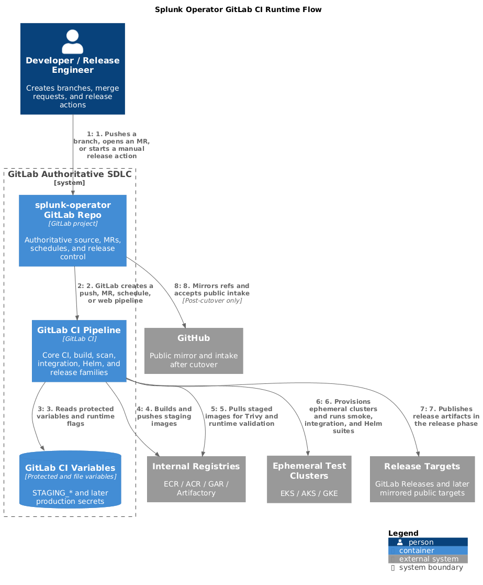
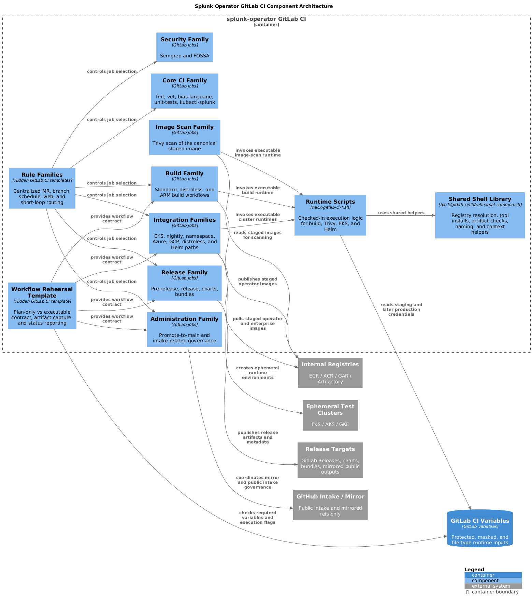

# GitLab CI Architecture Diagrams

This document provides the diagram set for the current GitLab CI migration architecture.

It is meant to answer two questions quickly:

- how the end-to-end GitLab CI flow is intended to work
- how the workflow families, runtime scripts, and external systems are partitioned inside the repo

## Generated PNGs

### C4 Runtime Flow

Source:

- [gitlab-ci-runtime-flow.puml](diagrams/gitlab-ci-runtime-flow.puml)

PNG:

- [gitlab-ci-runtime-flow.png](diagrams/gitlab-ci-runtime-flow.png)



### C4 Component Architecture

Source:

- [gitlab-ci-component-architecture.puml](diagrams/gitlab-ci-component-architecture.puml)

PNG:

- [gitlab-ci-component-architecture.png](diagrams/gitlab-ci-component-architecture.png)



## Diagram Intent

The runtime flow diagram shows the authoritative GitLab path after migration:

- developers and release engineers work through the GitLab repo
- GitLab CI reads GitLab-managed variables
- build and scan jobs push only to internal staging destinations
- integration and Helm jobs run against ephemeral clusters
- release publication remains a GitLab-driven path
- GitHub remains a mirror and intake surface after cutover, not an authoritative merge or release path

The component diagram shows how the current GitLab CI definition is partitioned:

- shared rule families
- shared workflow families
- checked-in runtime scripts
- a shared shell helper library
- external dependencies such as internal registries, test clusters, GitLab variables, and GitHub intake

## Regeneration

To regenerate the PNGs on a clean system with `plantuml` installed:

```bash
cd /home/vivekr/tmp/splunk-operator-gitlab-live-20260319-clean
plantuml -tpng docs/diagrams/gitlab-ci-runtime-flow.puml docs/diagrams/gitlab-ci-component-architecture.puml
```

These diagram sources use PlantUML C4 includes from the public C4-PlantUML project via `!includeurl`.
