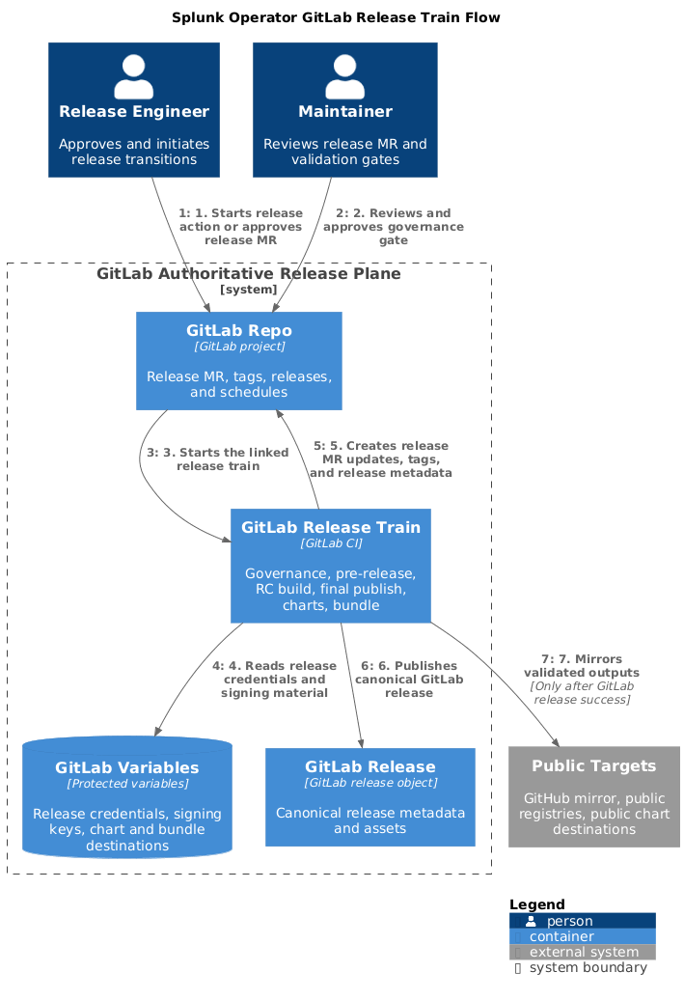
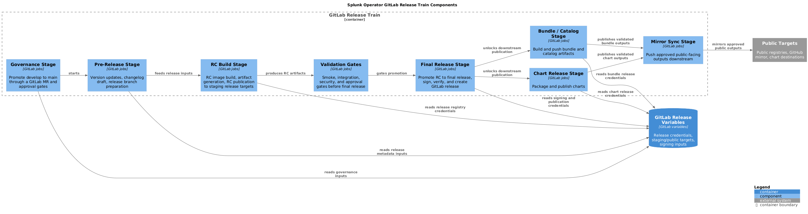

# GitLab Release Train Architecture

This document defines the target production-grade release train for the Splunk Operator GitLab migration.

It answers a narrower question than the general workflow review:

- how the existing GitHub release workflows fit together
- how they should be orchestrated in GitLab
- where manual approvals should remain
- where human intervention should be removed

## Source Workflow Mapping

The current GitHub release family is split across these files:

- `merge-develop-to-main-workflow.yml`
- `pre-release-workflow.yml`
- `automated-release-workflow.yml`
- `release.yml`
- `bundle-push-post-release.yml`

Those are not five unrelated workflows. They form one release train.

## Target GitLab Release Phases

### 1. Release Governance

- source:
  - `merge-develop-to-main-workflow.yml`
- target:
  - create a GitLab MR from `develop` to `main`
  - attach release metadata
  - record reviewer/approval requirements
  - produce RC candidate metadata

### 2. Pre-Release Preparation

- source:
  - `pre-release-workflow.yml`
- target:
  - update versions in docs, Helm, bundle metadata, manifests, and `.env`
  - generate changelog and release notes drafts
  - create a dedicated release branch or MR
  - publish only staging-safe artifacts during rehearsal

### 3. RC Build And Validation

- source:
  - `merge-develop-to-main-workflow.yml`
  - `automated-release-workflow.yml`
- target:
  - build RC UBI and distroless images
  - publish RC images to staging/internal release registries
  - generate RC release artifacts
  - attach artifacts to GitLab jobs or draft GitLab releases

### 4. Final Release Publication

- source:
  - `automated-release-workflow.yml`
- target:
  - promote RC images to final release tags
  - sign and verify release images
  - generate release manifests
  - create the canonical GitLab release object
  - mirror public-facing outputs only after GitLab release success

### 5. Chart Publication

- source:
  - `release.yml`
- target:
  - package charts in GitLab
  - publish chart assets to a staging chart location first
  - validate index layout
  - later mirror to public chart destinations as a downstream output

### 6. Bundle And Catalog Publication

- source:
  - `bundle-push-post-release.yml`
- target:
  - build bundle and catalog artifacts
  - push them to staging bundle/catalog destinations first
  - validate pull/install metadata before public publication

## Automation Principles

- GitLab is the authoritative release control plane.
- Public DockerHub or public ECR publication must never happen before GitLab has produced the canonical release result.
- RC and final release promotion should be one linked GitLab release train, not separate manual islands unless governance requires a manual approval gate.
- GitHub release publication is a mirrored downstream output, not the authoritative release creation step.
- Version mutation, artifact generation, chart release, and bundle publication should be checked-in scripts or templates, not large inline shell bodies.

## Expected GitLab Release Train Shape

The production target is one orchestrated release train with phases:

1. governance and release MR creation
2. pre-release content mutation and validation
3. RC image build and artifact creation
4. RC validation gates
5. final release publication
6. chart release
7. bundle and catalog publication
8. mirror and public artifact synchronization

## Human Intervention Boundaries

Manual approval is appropriate for:

- release MR approval
- RC-to-final promotion approval
- rollback decision

Manual execution is not the desired steady state for:

- version file updates
- artifact generation
- release note draft creation
- chart packaging
- bundle and catalog push
- public mirror synchronization

## Current Rehearsal Status

- release jobs are represented in `.gitlab-ci.yml`
- release family structure exists
- staging-only guardrails are already documented in the workflow metadata
- the release train is not yet fully implemented as executable GitLab runtime scripts

## Diagrams

Source and PNG files:

- [gitlab-release-train-flow.puml](diagrams/gitlab-release-train-flow.puml)
- [gitlab-release-train-flow.png](diagrams/gitlab-release-train-flow.png)
- [gitlab-release-train-components.puml](diagrams/gitlab-release-train-components.puml)
- [gitlab-release-train-components.png](diagrams/gitlab-release-train-components.png)

